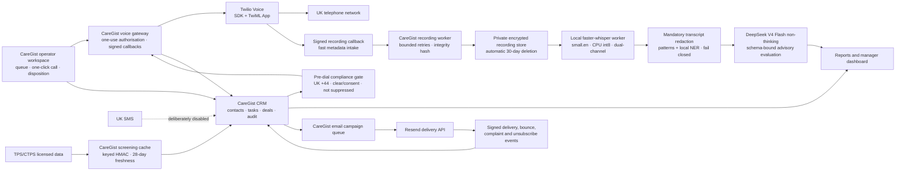

# CareGist lean UK CRM: operations and activation runbook

## Release scope

This release adds an organisation-scoped call-centre CRM to CareGist. It includes:

- contacts, notes, tasks, deals, pipeline stages, suppressions, and audit history;
- one-click browser calling, mandatory call dispositions, callbacks, and performance reports;
- automatic TPS/CTPS evidence checks before production calls;
- optional dual-channel call recording in private object storage for exactly 30 days;
- optional transcription, summaries, structured quality evaluation, and coaching actions;
- manager-approved UK email campaigns, unsubscribe handling, and signed delivery events;
- no UK SMS capability. South African telephony and messaging remain a separate future module.

The change is additive. `/crm` is a separate authenticated workspace, migrations 052 and 053 add new CRM data structures, and all mutable capabilities default to disabled. Existing CareGist routes and workflows remain active when `CRM_ENABLED=false`.

## Current architecture map

Update this map whenever a material service or trust boundary changes.



The production browser calling path is Twilio Voice SDK plus a TwiML App. An Elastic SIP Trunk is not required for the initial UK CRM and remains a future carrier/scale option.

## Fool-proof operator flow

1. The operator opens **Call queue** and sees a traffic-light status: Ready, Needs screening, or Do not call.
2. **Call now** remains unavailable unless CareGist has a current lawful screening result and no suppression.
3. CareGist re-checks the private screening cache immediately before creating a two-minute, one-use call authorisation.
4. Twilio receives the authorisation, while CareGist resolves the destination on the server. The browser cannot substitute a number.
5. When recording is enabled, the called party hears the approved recording notice before the parties are bridged.
6. After the call, the operator must choose a large disposition button before another call can start. A callback creates tomorrow's high-priority task; **Do not call** suppresses the number immediately.

Managers control imports, marketing evidence, campaigns, recording access, reports, and screening overrides. Agents see only their own recordings; owners and admins may access recordings across their organisation. Every sensitive action is auditable.

## Automatic TPS/CTPS screening

CareGist owns the ingestion and pre-call enforcement. It does not need a HubSpot or bOnline integration. Official TPS/CTPS register data still requires an appropriate licence or an approved screening provider; the CRM must not scrape or invent register results.

The manager uploads a UTF-8 CSV of no more than 5 MB or 20,000 rows:

```csv
phone_e164,status,screened_at
+442071234567,clear,2026-08-13T08:00:00Z
+441612345678,ctps,2026-08-13T08:00:00Z
```

The upload records its licensed source reference and SHA-256 digest, then discards the source file. Phone numbers in the screening cache are stored as keyed HMAC values, not reversible plaintext. Matching contacts receive evidence and TPS/CTPS entries become suppressions. Results for contacts not yet in the CRM stay in the cache and are applied when those contacts are later added.

In production mode, a call is permitted only when:

- the destination is a UK `+44` number;
- the screening result is `clear` or documented `consent_override`;
- the evidence is no older than 28 days; and
- neither the screened number nor the contact appears on CareGist's own suppression list.

If evidence is missing, stale, or ambiguous, the call fails closed. Specific consent overrides require a manager-entered evidence reference and timestamp; general consent or an existing relationship is not treated as an automatic override.

## Recording, transcripts, and 30-day deletion

Audio is never stored in PostgreSQL. On Twilio's signed completed-recording callback, CareGist:

1. validates the account, signature, recording SID, and duration, then queues metadata and responds immediately;
2. a bounded worker streams the recording only from CareGist's account-bound `api.twilio.com` URL with an enforced 100 MB limit;
3. the worker writes it to a private S3-compatible bucket using server-side encryption and a tenant/date object key;
4. it records the size and SHA-256 digest in PostgreSQL before the source-deletion worker asks Twilio to delete its copy;
5. it creates an AI job only when `CRM_AI_ENABLED=true`.

Playback uses a 60-second signed private URL and is audit logged. At `expires_at`, the maintenance worker purges the transcript, summary, and evaluation, then deletes the private object and Twilio source independently so an outage at either provider cannot block the other deletion. Configure a 30-day bucket lifecycle rule as independent defence in depth. `CRM_RECORDING_RETENTION_DAYS` is a startup invariant and any value other than `30` prevents the application from starting.

Transcription is local: the dedicated worker runs faster-whisper `small.en` on CPU `int8`, rejects mono or malformed audio, and deterministically maps Twilio's parent channel to **Agent** and child channel to **Contact**. It redacts names, telephone numbers, email addresses, identifiers and sensitive lines before the only external AI boundary. Redaction uncertainty fails closed. Only the redacted transcript and a pseudonymous HMAC identifier may be sent to the allowlisted DeepSeek HTTPS origin. DeepSeek V4 Flash runs with thinking disabled and strict JSON validation. AI output is advisory: it cannot mutate disposition, compliance, suppression, employment or legal state.

## Email campaigns

UK campaigns are disabled until a manager records a valid basis for every selected contact. Corporate-subscriber, consent, and soft-opt-in rules are distinguished; suppressed or ineligible recipients block the whole launch. A manager must explicitly confirm each send.

CareGist escapes operator content, adds the configured postal address and a per-recipient unsubscribe link, queues each delivery with a stable provider idempotency key, and accepts delivery/bounce/complaint events only through a verified Resend/Svix signature. Unsubscribes, bounces, complaints, and provider suppressions stop future email automatically.

## Safe deployment order

1. Back up and verify the target database.
2. Apply migrations `052_crm_calling_mvp.sql`, `053_crm_full_uk.sql`, and `054_crm_completion_controls.sql` in order before deploying application code. Migration 054 forces CRM RLS, adds tenant-consistent foreign keys, companies, worker heartbeats, AI usage evidence and final disposition controls.
3. Deploy with every CRM feature flag false and run the existing CareGist smoke tests.
4. Enable only `CRM_ENABLED=true` in an isolated preview; verify authentication, tenant isolation, contacts, tasks, deals, reports, and audit records.
5. Configure the private screening HMAC key and ingest licensed TPS/CTPS results.
6. Configure Twilio resources and credentials in the deployment secret manager. Never place them in source control or a browser environment variable.
7. Keep `CRM_PILOT_MODE=true`; add only a phone owned or controlled by CareGist to `CRM_ALLOWED_TEST_NUMBERS`.
8. Enable the global outbound gate and CRM calling in preview, then make one supervised call to that test phone. Recording remains off for the first call.
9. Configure the private recording bucket, approved notice version, 30-day lifecycle, and deletion alerts. Enable recording only for a supervised test after the notice and privacy wording are approved.
10. Configure Resend's signed webhook and sender address, then send one campaign only to internal test inboxes.
11. Configure AI API keys and validate a test transcript/evaluation without using customer data.
12. Only after all acceptance checks pass, set `CRM_PILOT_MODE=false` and activate production calling. Production still blocks any number without current screening evidence.

The scheduled maintenance endpoint is `/api/v1/cron/crm-maintenance`; it runs hourly. The existing hourly email queue cron remains separate. Both require `CRON_SECRET`.

## Configuration contract

```text
CRM_ENABLED=false
CRM_CALLING_ENABLED=false
CRM_PILOT_MODE=true
CRM_ALLOWED_TEST_NUMBERS=+44...

CRM_SCREENING_HASH_KEY=<at least 32 random characters>

CRM_RECORDING_ENABLED=false
CRM_RECORDING_RETENTION_DAYS=30
CRM_RECORDING_NOTICE_VERSION=
CRM_RECORDING_S3_ENDPOINT_URL=
CRM_RECORDING_S3_REGION=auto
CRM_RECORDING_S3_BUCKET=
CRM_RECORDING_S3_ACCESS_KEY_ID=
CRM_RECORDING_S3_SECRET_ACCESS_KEY=

CRM_EMAIL_CAMPAIGNS_ENABLED=false
CRM_EMAIL_SENDER_POSTAL_ADDRESS=
RESEND_API_KEY=
RESEND_WEBHOOK_SECRET=

CRM_UK_SMS_ENABLED=false
CRM_AI_ENABLED=false
CRM_TRANSCRIPTION_MODEL=small.en
CRM_TRANSCRIPTION_DEVICE=cpu
CRM_TRANSCRIPTION_COMPUTE_TYPE=int8
CRM_TRANSCRIPTION_CPU_THREADS=4
CRM_TRANSCRIPTION_TIMEOUT_SECONDS=900
CRM_AI_BASE_URL=https://api.deepseek.com/v1
CRM_AI_API_KEY=
CRM_AI_PSEUDONYM_KEY=<at least 32 random characters>
CRM_AI_MODEL=deepseek-v4-flash
CRM_AI_MONTHLY_CAP_USD=10

TWILIO_ACCOUNT_SID=
TWILIO_API_KEY_SID=
TWILIO_API_KEY_SECRET=
TWILIO_AUTH_TOKEN=
TWILIO_TWIML_APP_SID=
TWILIO_PHONE_NUMBER=
TWILIO_REGION=ie1
TWILIO_EDGE=dublin
TWILIO_WEBHOOK_BASE_URL=https://www.caregist.co.uk
```

Calling additionally requires `OUTBOUND_COMMUNICATIONS_ENABLED=true`. Email campaigns require that global gate, Resend credentials, the signed webhook secret, and a real postal address. UK SMS set to true is a fatal configuration error.

## Acceptance criteria

- Unauthenticated `/crm` access redirects to login; users cannot read or change another organisation's data.
- A missing, stale, TPS/CTPS-listed, non-UK, or locally suppressed number cannot be called.
- A call authorisation expires, works once, and cannot be replayed or redirected by the browser.
- Missing, invalid, account-mismatched, duplicate, and out-of-order Twilio callbacks are rejected or handled idempotently.
- The first supervised call displays the approved CareGist caller ID and creates the correct duration, outcome, activity, and audit evidence.
- An agent cannot start the next call until the prior terminal call has a disposition.
- Recording-off TwiML explicitly uses `do-not-record`.
- Recording-on playback is private, short lived, role checked, and audited; source and stored copies are deleted as designed.
- TPS/CTPS import rejects malformed, duplicate, future-dated, oversized, and non-UK rows without partially applying the file.
- Campaigns reject ineligible or suppressed contacts; unsubscribe, bounce, and complaint events suppress future sends.
- AI jobs retry with bounded attempts, accept only a bounded structured evaluation, and are visibly advisory.
- Existing CareGist tests and smoke flows still pass with every CRM flag false.

## Kill switches and recovery

Set `CRM_CALLING_ENABLED=false` to stop new calls, `CRM_RECORDING_ENABLED=false` to stop new recordings, `CRM_EMAIL_CAMPAIGNS_ENABLED=false` to stop new campaigns, and `CRM_AI_ENABLED=false` to stop new AI jobs. Set `CRM_ENABLED=false` to remove the workspace without deleting its evidence.

Do not run the down migrations as an operational rollback: they destroy CRM structures and data. Preserve records for incident investigation and audit unless a separately approved data-deletion procedure applies.

## Remaining external actions

Code completion does not authorise spending or accepting supplier terms. Twilio API-key creation, account upgrade, number purchase, and any regulatory bundle must be confirmed at the exact action. The production gate also requires the licensed TPS/CTPS data source, approved recording/privacy wording, provider secrets, and one supervised test call.
